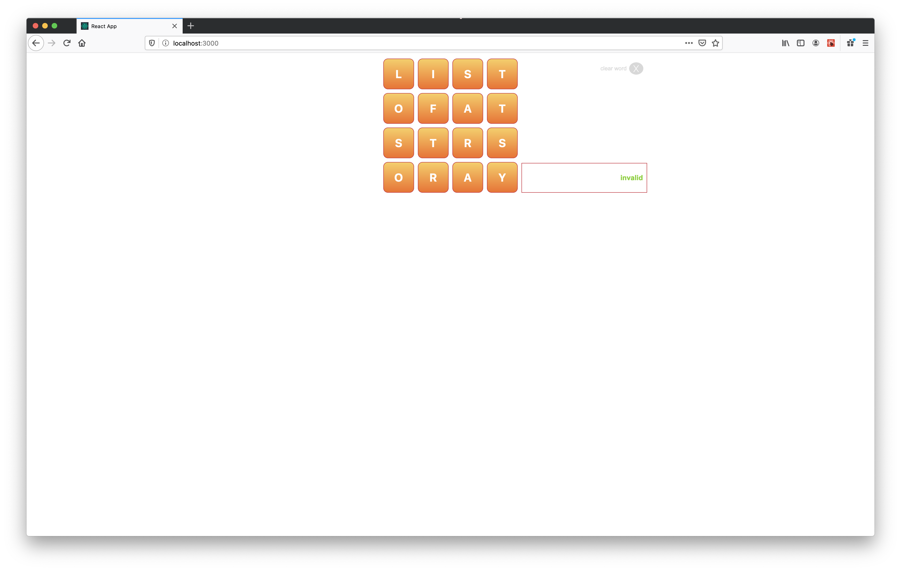

 # App created for Front End Interview

## Part 1 - Required if applying to Full Stack or Front End positions

This project was bootstrapped with [Create React App](https://github.com/facebook/create-react-app).

`npx create-react-app word-app`

All of the files in the src folder were deleted, [Components](src/components) has all the code created for this app and the [CSS](src/index.css) was modified for this also

In the project directory, you need to run:

`yarn start`

Open [http://localhost:3000](http://localhost:3000) to view it in the browser.

The App is using the [test json file 2](src/test-board-2.json) for changing this you need to change line 3 of [Board.js](src/components/Board.js)

`import data from '../test-board-2.json'`

- Layout for mobile media:

		

- Layout for desktop media (ReactJS only):

		

## Part 3 – Required for all applicants

At the end of the [Code Revision File](public/code_revision.txt) is a list of problems or improvements